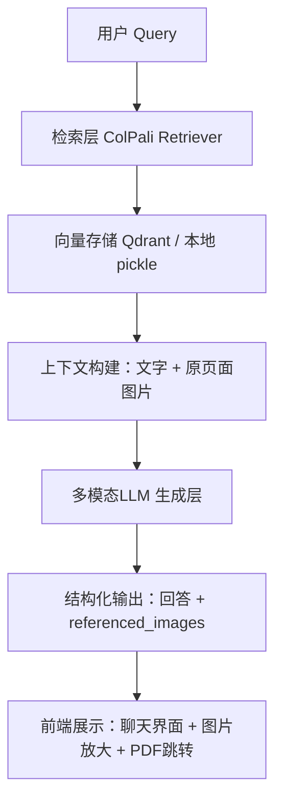

```
# MoldMind 项目技术架构文档（完整提示词）

**项目目标**  
构建一个专为总工办模具工程师服务的**多模态RAG问答系统**。  
输入：工程师的自然语言问题（中文）  
知识源：一份包含大量文字 + 模具图片的PDF文档（图文混排、模具结构图、标注、尺寸等）  
输出：准确的自然语言回答 + 直接引用并展示PDF中对应的原模具图片 + 页码出处  

核心要求：  
- 必须使用 **ColPali 视觉原生方案**（不依赖传统OCR和文本解析，直接吃页面图片，保留模具图片的所有视觉细节）。  
- 使用 **LlamaIndex** 作为整体编排框架（方便后续扩展 Agent、多轮对话、UI 等）。  
- 优先在本地 Mac（Apple Silicon）环境下运行，模型全部走本地或 ModelScope 国内下载。  
- 最终实现：用户问问题 → 系统从PDF中检索相关页面（文字+图片）→ 多模态LLM生成回答并展示原图。

---

## 1. 整体架构概览（分层设计）



**核心流程**：

1. 离线摄入（一次）：PDF → 每页转图片 → ColPali 多向量嵌入 → 存索引
2. 在线查询：Query → ColPali 检索 Top-K 页面 → 构建上下文 → 多模态LLM 生成

------

## 2. 模型与资源清单（全部需在 Mac venv 中准备）

### 2.1 文档解析 & 嵌入模型（核心视觉部分）

- ColQwen2.5

  ：

  vidore/colqwen2.5-v0.2

  （ModelScope 本地下载）

  - 用途：页面图片 → 多向量（Multi-Vector / Late-Interaction）嵌入
  - 类：ColQwen2_5 + ColQwen2_5_Processor
  - 设备：mps（Apple Silicon）
  - 加载路径：本地 ./models/colqwen2.5-v0.2

### 2.2 后续可能使用的模型（可先不加载）

- 多模态生成LLM（推荐任选其一）：
  - Qwen2-VL-72B / 7B（本地开源，中文强）
  - GPT-4o / Claude-3.5 Sonnet（云API，最高效果）
- 文本嵌入（可选 Hybrid Search 时使用）：BGE-large-zh-v1.5

### 2.3 工具包（已安装或需安装）

- pdf2image + Poppler（PDF → 高清页面图片，dpi=300）
- colpali-engine（最新版 GitHub 安装）
- llama-index 全家桶（核心框架）
- llama-index-vector-stores-qdrant（推荐向量库）
- qdrant-client
- pillow, tqdm, pypdfium2, torch（MPS版）

------

## 3. 各模块详细设计

### 3.1 文档解析层（Ingestion Pipeline）—— 当前最优先模块

- 输入：单份PDF文件（可后续扩展成文件夹）
- 处理步骤：
  1. 使用 pdf2image.convert_from_path(dpi=300) 将每页PDF渲染成PNG图片（保留模具图所有细节）。
  2. 对每张页面图片使用 ColQwen2_5 生成 **多向量嵌入**（不是单向量！每个页面产生多个 patch 向量）。
  3. 同时保存页面元数据：{"page_num": int, "image_path": str, "pdf_name": str}
  4. 可选：将每页图片保存到磁盘（用于后续展示和调试）。
- 输出：一个 colpali_index.pkl 文件（或存入 Qdrant），包含所有页面的多向量 + 元数据。
- 注意：整个过程完全视觉原生，不做OCR，不依赖文本分块。

### 3.2 向量存储层

- 首选：

  Qdrant

  （支持多向量、late-interaction、ColPali 最佳）

  - Collection 名：mold_documents
  - 存储内容：ColPali 多向量 + 页面元数据 + 原图片路径

- 备选（快速原型）：本地 pickle 文件（适合单PDF起步）

- 未来扩展：支持增量更新PDF（新增/删除页面时只更新对应嵌入）

### 3.3 检索层（Retriever）

- 使用 ColPali 的 MaxSim late-interaction 机制进行页面级检索。
- 支持混合检索（ColPali 视觉向量 + 关键词 BM25，可选）。
- 流程：
  1. Query → 转 token 向量
  2. 与索引中每页的多向量做 MaxSim 计算
  3. Top-K（推荐先召回 15-20 页，再 rerank 到 5-8 页）
  4. 返回结果：每个结果包含 page_image（原图）、page_num、score
- LlamaIndex 集成方式：自定义 ColPaliRetriever 类，继承 BaseRetriever，输出 ImageNode 或 NodeWithScore。

### 3.4 上下文构建层

- 把检索到的 Top-K 页面图片 + 对应页面的文字描述（可选通过简单OCR补充）打包成多模态上下文。
- 格式要求：传给LLM时必须包含**原图片（base64 或本地路径）**，不能只传文字。

### 3.5 生成层（Multimodal LLM）

- 模型：Qwen2-VL（推荐）或 GPT-4o/Claude-3.5
- Prompt 要求（必须严格遵守）：
  - 系统角色：你是模具工程专家，必须基于提供的PDF页面图片和文字回答。
  - 输出格式：严格JSON { "answer": "...", "referenced_images": [{"page": 5, "description": "XX模具冷却水道图", "image_path": "..."}] }
  - 强制引用：回答中必须标注“见PDF第X页图Y”
- 目标：生成自然语言回答 + 自动带出原模具图片供前端展示。

### 3.6 应用层（用户界面与API）

- 后端：FastAPI + LlamaIndex QueryEngine
- 前端：Gradio 或 Streamlit（快速） / React + Ant Design（生产）
- 功能：
  - 聊天界面
  - 支持上传新问题
  - 展示回答 + 点击放大原PDF图片
  - 点击跳转到PDF对应页（可选用 pdf.js）
  - 聊天历史、多轮对话

### 3.7 部署与环境

- 环境：Mac venv（Apple Silicon），优先本地运行
- Docker 支持（未来）
- 安全：全部本地部署，PDF不对外暴露

------

## 4. 实施优先级（建议分阶段）

**Phase 1（当前）**：文档解析 + ColPali 索引（ingest_colpali_llamaindex.py） **Phase 2**：ColPali Retriever + LlamaIndex QueryEngine **Phase 3**：多模态LLM 生成 + 结构化输出 **Phase 4**：前端界面 + FastAPI 服务 **Phase 5**：优化（rerank、Hybrid Search、PDF更新机制）

------

## 5. 注意事项 & 潜在挑战

- ColPali 是多向量 late-interaction，不要用传统单向量逻辑。
- 图片传输：大图片需压缩或用 URL 引用，避免 Token 爆炸。
- Mac MPS 内存：单次加载 ColQwen2.5 + LLM 时注意显存（7B版更稳）。
- 模型兼容：必须用 ColQwen2_5 类加载 colqwen2.5-v0.2。
- 测试用例：准备 10 个工程师真实问题（含“这个模具的冷却水道在哪里”“XX模具的结构图”）。

------

**请根据以上完整架构，为我生成完整的、可直接运行的项目代码结构（包含目录结构、所有核心脚本、Prompt模板、requirements.txt）。优先实现 Phase 1 和 Phase 2，使用本地模型和 Qdrant（如果暂时不想装 Qdrant，也可用 pickle）。**

------

**文档结束** 你可以直接把上面整个 Markdown 复制给 Claude，让它按照这个规范开始写代码。 如果需要我再补充某个模块的详细代码模板或目录结构，随时告诉我！